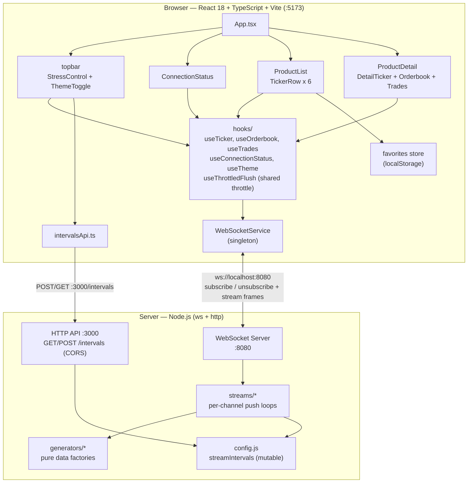
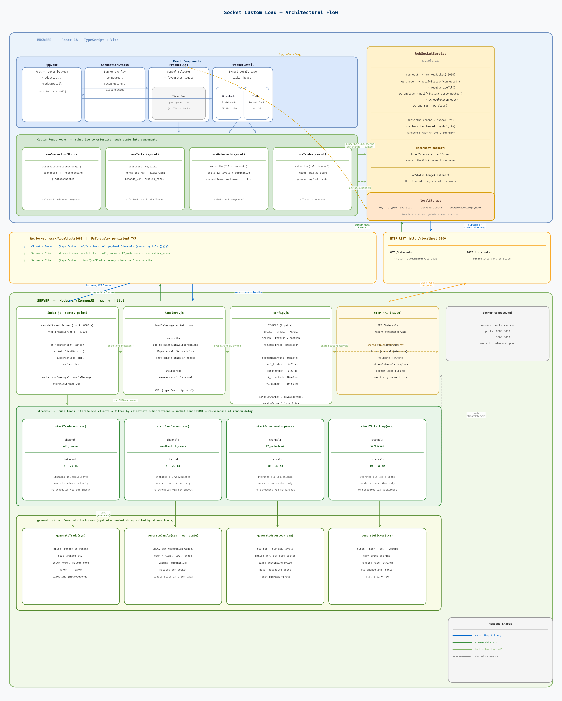

# Socket Stress Test Server

A WebSocket server for stress testing crypto trading frontends. Streams realistic market data at configurable high frequencies.

## Setup

```bash
bun install
bun start
```

Or with Docker:

```bash
docker compose up
```

## Ports

| Port | Protocol | Purpose |
|------|----------|---------|
| 8080 | WebSocket | Market data streams |
| 3000 | HTTP | Runtime config API |

## Supported Channels

| Channel | Description | Default Interval |
|---------|-------------|-----------------|
| `all_trades` | Trade executions | 5-20ms |
| `candlestick_<res>` | OHLCV candles (`1m`, `5m`, `15m`, `30m`, `1h`, `4h`, `1d`, `1w`) | 5-20ms |
| `l2_orderbook` | 500-level bid/ask orderbook | 10-40ms |
| `v2/ticker` | Price ticker with mark, volume, funding | 10-50ms |

## Supported Symbols

| Symbol | Price Range | Precision |
|--------|------------|-----------|
| BTCUSD | 60000.0 - 65000.0 | 1 dp |
| ETHUSD | 1500.00 - 2000.00 | 2 dp |
| XRPUSD | 1.0000 - 2.0000 | 4 dp |
| SOLUSD | 70.0000 - 80.0000 | 4 dp |
| PAXGUSD | 5000.00 - 5500.00 | 2 dp |
| DOGEUSD | 0.000000 - 0.100000 | 6 dp |

## Subscribe / Unsubscribe

Connect to `ws://localhost:8080` and send JSON messages. No data streams until you subscribe.

### Subscribe

```json
{
  "type": "subscribe",
  "payload": {
    "channels": [
      { "name": "all_trades", "symbols": ["BTCUSD", "ETHUSD"] },
      { "name": "candlestick_1m", "symbols": ["BTCUSD"] },
      { "name": "l2_orderbook", "symbols": ["BTCUSD"] },
      { "name": "v2/ticker", "symbols": ["SOLUSD", "DOGEUSD"] }
    ]
  }
}
```

### Unsubscribe specific symbols

```json
{
  "type": "unsubscribe",
  "payload": {
    "channels": [
      { "name": "all_trades", "symbols": ["ETHUSD"] }
    ]
  }
}
```

### Unsubscribe entire channel (omit symbols)

```json
{
  "type": "unsubscribe",
  "payload": {
    "channels": [
      { "name": "l2_orderbook" }
    ]
  }
}
```

### Ack response

After every subscribe/unsubscribe, the server responds with the current state:

```json
{
  "type": "subscriptions",
  "payload": {
    "channels": [
      { "name": "all_trades", "symbols": ["BTCUSD"] },
      { "name": "v2/ticker", "symbols": ["SOLUSD", "DOGEUSD"] }
    ]
  }
}
```

## Runtime Config API

Modify streaming intervals without restarting the server.

### Get current intervals

```bash
curl http://localhost:3000/intervals
```

### Update intervals

```bash
# Crank up trades to max stress
curl -X POST http://localhost:3000/intervals \
  -H "Content-Type: application/json" \
  -d '{"all_trades": {"min": 1, "max": 5}}'

# Update multiple channels
curl -X POST http://localhost:3000/intervals \
  -H "Content-Type: application/json" \
  -d '{"all_trades": {"min": 1, "max": 5}, "l2_orderbook": {"min": 10, "max": 20}}'
```

CORS is enabled (`Access-Control-Allow-Origin: *`, with `OPTIONS` preflight handling) so the
client dev server (`http://localhost:5173`) can call this API directly — used by the in-app
"Update speed" stress control (Normal / Fast / Extreme presets).

## Project Structure

```
socket-test/
├── index.js              Server setup, connection handler, HTTP API
├── config.js             Symbols, channels, intervals, validation helpers
├── handlers.js           Subscribe/unsubscribe message handler
├── generators/
│   ├── index.js          Barrel export
│   ├── all_trades.js     Trade data generator
│   ├── candlestick.js    OHLCV candle generator
│   ├── l2_orderbook.js   Orderbook generator
│   └── ticker.js         Ticker generator
├── streams/
│   ├── index.js          Barrel export + startAllStreams()
│   ├── all_trades.js     Trade stream loop
│   ├── candlestick.js    Candle stream loop
│   ├── l2_orderbook.js   Orderbook stream loop
│   └── ticker.js         Ticker stream loop
├── Dockerfile
└── docker-compose.yml
```

## Architecture

The system has three layers: a React client (browser), a transport layer
(WebSocket + HTTP), and a Node.js server that generates and streams synthetic
market data.



> `architecture.png` below is the original diagram from the initial
> implementation. It still accurately describes the **server layer**
> (`index.js`, `handlers.js`, `config.js`, `streams/*`, `generators/*`, the
> `:8080` WebSocket server and `:3000` HTTP API). The **browser layer** in
> that image predates the dark mode, stress-control, and performance-tuning
> work below — for the current browser architecture, use the file tree,
> bullets, and Mermaid diagram on this page instead. The diagram above
> renders natively on GitHub and most Markdown viewers (and degrades to a
> readable text block where it doesn't), so it should stay legible "in every
> format".



### Browser layer (`client/`)

```
client/src/
├── App.tsx                        Root component: topbar + list/detail view
├── components/
│   ├── ConnectionStatus/          Shows live/reconnecting/offline state
│   ├── StressControl/             Normal/Fast/Extreme → POST /intervals
│   ├── ThemeToggle/                Light/dark theme switch
│   ├── ProductList/               Symbol list + per-row ticker (TickerRow)
│   ├── ProductDetail/             Detail view: ticker header + orderbook + trades
│   │   └── DetailTicker.tsx        Memoized hero price/stats, own useTicker
│   ├── Orderbook/                 L2 orderbook table
│   └── Trades/                    Recent trades feed
├── hooks/
│   ├── useConnectionStatus.ts     Subscribes to wsService status changes
│   ├── useTicker.ts               Subscribes to v2/ticker, normalizes data
│   ├── useOrderbook.ts            Subscribes to l2_orderbook, builds 12-level book
│   ├── useTrades.ts               Subscribes to all_trades, dedupes + caps at 30
│   ├── useThrottledFlush.ts       Shared timer-based throttle for stream flushes
│   └── useTheme.ts                 Reads/writes data-theme, persists to localStorage
├── services/
│   ├── WebSocketService.ts        Singleton: connect/subscribe/reconnect
│   └── intervalsApi.ts             GET/POST :3000/intervals (stress presets)
├── store/
│   └── favorites.ts                Favorites persisted to localStorage
└── types/
    └── index.ts                    Shared TypeScript types
```

- **Components** render UI and call hooks for live data; `App.tsx` renders a
  `topbar` (`StressControl` + `ThemeToggle`), always renders
  `ConnectionStatus`, and toggles between `ProductList` and `ProductDetail`.
- **Hooks** call `wsService.subscribe(channel, symbol, handler)` on mount and
  `unsubscribe` on unmount/symbol change, converting raw server payloads
  (e.g. `RawTicker`, `RawTrade`) into the UI-friendly types in `types/index.ts`.
  `useTicker`, `useOrderbook`, and `useTrades` all coalesce bursts of incoming
  messages through the shared `useThrottledFlush` hook (a `setTimeout`-based
  leading+trailing throttle) before calling `setState`, keeping render rate
  bounded (~5-10 updates/sec) even when the server streams every 1ms under the
  Extreme stress preset.
- **`WebSocketService`** is a singleton that owns the single WebSocket
  connection. It tracks subscriptions in a `Map<'channel:symbol', Set<handler>>`,
  dispatches incoming messages to the matching handlers, and auto-connects on
  load. `disconnect()` plus a Vite `import.meta.hot.dispose` hook close the
  socket cleanly on HMR reloads so dev-mode edits don't stack duplicate
  connections.
- **`useTheme`** toggles `data-theme="light"|"dark"` on `<html>`, persisted to
  `localStorage`, applied pre-paint via an inline script in `index.html` to
  avoid a flash of the wrong theme.
- **`StressControl`** posts `streamIntervals` presets (Normal/Fast/Extreme) to
  the server's `/intervals` endpoint via `intervalsApi.ts` (see
  [Runtime Config API](#runtime-config-api)).
- **`favorites` store** reads/writes the `crypto_favorites` key in
  `localStorage` so favorited symbols persist across reloads.

### Transport layer

| Connection | URL | Carries |
|---|---|---|
| WebSocket | `ws://localhost:8080` | subscribe/unsubscribe requests, ack responses, and streamed `all_trades` / `candlestick_<res>` / `l2_orderbook` / `v2/ticker` messages |
| HTTP REST | `http://localhost:3000/intervals` | GET/POST runtime stream-interval config |

### Server layer

- **`index.js`** starts the WebSocket server (`ws`) on `:8080` and an HTTP
  server on `:3000`. Each new socket gets a `clientData` object
  (`{ subscriptions: Map<channel, Set<symbol>>, candles: Map }`) and
  `startAllStreams(wss)` is called once to begin the push loops.
- **`handlers.js`** processes incoming `subscribe`/`unsubscribe` messages,
  mutates the socket's `clientData.subscriptions`, initializes per-symbol
  candle state, and replies with a `{ type: 'subscriptions' }` ack reflecting
  the client's full current subscription state.
- **`config.js`** holds `SYMBOLS` (price ranges/precision per symbol), the
  mutable `streamIntervals` (min/max ms per channel, editable via the HTTP
  API), validators (`isValidChannel`, `isValidSymbol`, `parseCandleResolution`)
  and helpers (`randomPrice`, `formatPrice`).
- **`generators/`** are pure functions that build one message payload each —
  `generateTrade`, `generateCandle`, `generateOrderbook`, `generateTicker`.
- **`streams/`** run one loop per channel (`startTickerLoop`, etc.). Each
  loop iterates `wss.clients`, skips sockets not subscribed to that
  channel/symbol, calls the matching generator, sends the JSON message, then
  reschedules itself via `setTimeout` using a random delay drawn from
  `streamIntervals` for that channel.

### Data flow

1. The browser loads, `wsService` auto-connects to `ws://localhost:8080`.
2. As components mount, hooks call `wsService.subscribe(...)`, which sends a
   `subscribe` message and registers a local handler.
3. `handlers.js` updates `clientData.subscriptions` on the server and replies
   with a `subscriptions` ack.
4. The relevant `streams/*` loop(s) start including this socket — each tick
   they generate fresh data via `generators/*` and push it as JSON.
5. `WebSocketService` receives each message, looks up handlers for
   `channel:symbol`, and invokes them; hooks normalize the payload and update
   component state, re-rendering the UI.
6. On unmount/symbol change, hooks call `unsubscribe`, removing the symbol
   from `clientData.subscriptions` so the server stops sending it data for
   that socket.

### Reconnection & resilience

If the WebSocket connection drops, `WebSocketService`:

1. Notifies listeners via `onStatusChange()` (e.g. `ConnectionStatus` shows
   "reconnecting").
2. Schedules a reconnect attempt with exponential backoff, starting at 1s and
   doubling up to a 30s cap.
3. On successful reconnect, calls `resubscribeAll()` to re-send `subscribe`
   messages for every channel/symbol that was active before the drop, so the
   server resumes streaming without the user re-navigating.

### Runtime config

The HTTP API on `:3000` lets you read/update `streamIntervals` in `config.js`
without restarting the server (see [Runtime Config API](#runtime-config-api)
above) — changes take effect on each stream loop's next reschedule.
